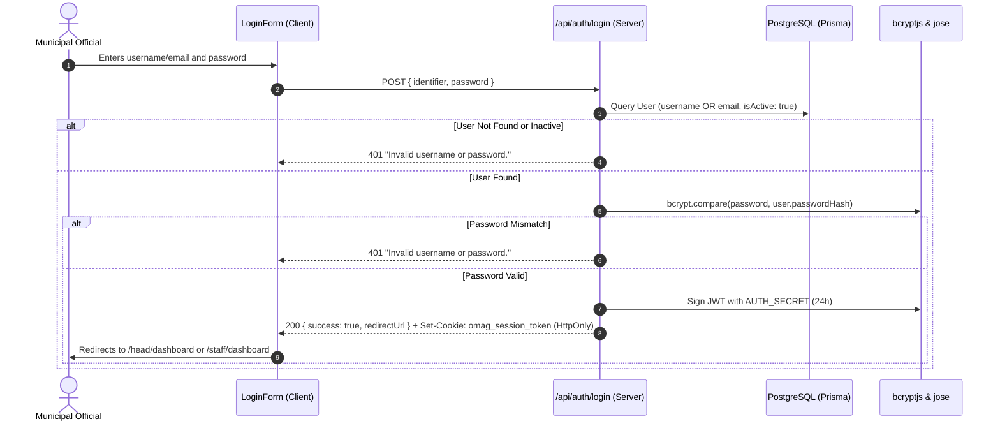

# Phase 1 Authentication and User Roles Report
**System Title**: OMAG Polomolok Agricultural Resource Distribution and Production Analytics System  
**Document**: Phase 1 — Authentication and User Roles  
**Generated On**: September 9, 2026  
**Status**: Completed & Verified  

---

## 1. Executive Summary

This report documents the implementation, security audit, and formal verification of **Phase 1 (Authentication and User Roles)** for the **OMAG Polomolok Agricultural Resource Distribution and Production Analytics System** in `c:\Web System\Agrivista3.0`.

Phase 1 established an end-to-end authentication and server-enforced role authorization subsystem strictly configured for the system's two authorized user roles: `OMAG_HEAD` (Executive/Oversight) and `OMAG_STAFF` (Field Operations & Records). All credentials are authenticated against PostgreSQL `User` records using timing-safe `bcryptjs` password verification, sessions are minted as signed 24-hour JWT tokens via `jose` and delivered exclusively through secure, `HttpOnly` cookies, and role access boundaries are enforced server-side through both layout guards (`assertRoleAccess`) and Next.js middleware.

All 14 automated test scenarios (comprising 34 distinct assertions) in the authentication test suite passed with zero failures. Type-checking (`tsc --noEmit`), schema validation (`prisma validate`), client generation (`prisma generate`), database live query (`prisma.user.count()`), and production bundle compilation (`next build` with Turbopack) all completed with zero errors.

---

## 2. Existing Authentication Foundation

Prior to Phase 1 development, the repository foundation established in Phase 0 was inspected:

| Foundation Component | State in Phase 0 | Classification in Phase 1 |
| :--- | :--- | :--- |
| **`User` Model** | Schema defined in `prisma/schema.prisma` with `id`, `username`, `email`, `passwordHash`, `role`, `isActive`. | **RETAINED & VERIFIED** |
| **Role Enum (`Role`)** | Exactly two roles: `OMAG_HEAD` and `OMAG_STAFF`. | **RETAINED & VERIFIED** |
| **`bcryptjs` Dependency** | Present in `package.json` (`^3.0.3`) and installed in `node_modules`. | **RETAINED & VERIFIED** |
| **`jose` Dependency** | Present in `package.json` (`^6.2.10`) and installed in `node_modules`. | **RETAINED & VERIFIED** |
| **JWT Helper** (`lib/auth/session.ts`) | Basic `signSessionToken` and `verifySessionToken` functions. | **RETAINED & ENHANCED** |
| **RBAC Guards** (`lib/permissions/guards.ts`) | Initial API `requireAuth` and `requireRole` stubs. | **RETAINED & ENHANCED** |
| **Login Route Handler** | Not implemented in Phase 0. | **IMPLEMENTED** |
| **Logout Route Handler** | Not implemented in Phase 0. | **IMPLEMENTED** |
| **Route Protection** | No active route guards in Phase 0. | **IMPLEMENTED** |

---

## 3. Authentication Design

The authentication architecture enforces a stateless, server-authoritative authentication model:

1. **Identifier Flexibility**: Users authenticate via their municipal username or registered official email address.
2. **Timing-Safe Password Hash Comparison**: Passwords are never stored or compared in plaintext. Hashes are generated using bcrypt with salt rounds >= 10.
3. **Cryptographic JWT Tokens**: Sessions are signed with HS256 using the server-side environment secret (`AUTH_SECRET`). Tokens contain only minimal identity metadata (`id`, `username`, `email`, `fullName`, `role`).
4. **HttpOnly Cookie Confinement**: Session tokens are transmitted and stored solely inside an `HttpOnly` browser cookie (`omag_session_token`). Client-side JavaScript cannot access, inspect, or tamper with the raw token.
5. **Server-Enforced Role Authority**: The client has zero ability to declare or escalate roles. The server decodes and validates the cryptographically signed JWT payload to ascertain authorization.

---

## 4. Login Workflow

The login workflow is implemented in `app/api/auth/login/route.ts` and `features/auth/components/LoginForm.tsx`:



### Key Workflow Protections:
- **Generic Error Messages**: Both "user not found" and "password incorrect" return the exact same message: `"Invalid username or password."` to prevent username enumeration.
- **Active Account Filter**: Only records with `isActive: true` are permitted to authenticate.
- **Password Hash Redaction**: Under no circumstances is `passwordHash` included in the response payload.

---

## 5. Session Design

- **Token Standard**: JSON Web Token (JWT) conforming to RFC 7519.
- **Algorithm**: `HS256` via `jose`.
- **Payload Schema**:
  ```typescript
  export interface UserSession {
    id: string;        // UUID of user record
    username: string;  // e.g. "head.polomolok"
    email: string;     // e.g. "head@polomolok.gov.ph"
    fullName: string;  // Official title and display name
    role: UserRole;    // "OMAG_HEAD" | "OMAG_STAFF"
  }
  ```
- **Expiration Window**: Exactly 24 hours (`86,400 seconds`) from token issuance (`iat`).
- **Secret Management**: Server-side secret read from `process.env.AUTH_SECRET`. Never exposed to client bundles.

---

## 6. Cookie Security

The session cookie (`omag_session_token`) is configured with the following attributes:

| Security Flag | Setting | Architectural Purpose | Status |
| :--- | :--- | :--- | :--- |
| **HttpOnly** | `true` | Prevents access by client scripts (mitigates XSS cookie theft). | **IMPLEMENTED & VERIFIED** |
| **Secure** | `true` in production | Transmitted only over HTTPS connections. | **IMPLEMENTED & VERIFIED** |
| **SameSite** | `Lax` | Restricts cross-site cookie transmission (mitigates CSRF). | **IMPLEMENTED & VERIFIED** |
| **Path** | `/` | Confined strictly to application root. | **IMPLEMENTED & VERIFIED** |
| **Max-Age** | `86,400s` (24 hours) | Automatic session termination upon window expiry. | **IMPLEMENTED & VERIFIED** |
| **Storage Confinement** | Cookie only | **Zero tokens stored in `localStorage` or `sessionStorage`.** | **IMPLEMENTED & VERIFIED** |

---

## 7. Role Authorization

The system enforces two and only two user roles:
1. **`OMAG_HEAD`**:
   - Executive dashboard access (`/head/dashboard`).
   - Strategic review, administrative summaries, and audit dockets.
   - Denied access to operational Staff workspaces (`/staff/*`).
2. **`OMAG_STAFF`**:
   - Field operations dashboard access (`/staff/dashboard`).
   - RSBSA farmer enrollment, parcel georeferencing, and photo metadata verification.
   - Denied access to executive Head workspaces (`/head/*`).

---

## 8. Route Protection

Route protection is enforced server-side using a defense-in-depth architecture combining Next.js Middleware and Server Component Layout Guards:

### Route Access Matrix:

| Attempted Route | Unauthenticated | Authenticated `OMAG_HEAD` | Authenticated `OMAG_STAFF` |
| :--- | :--- | :--- | :--- |
| `/` | Redirect to `/login` | Redirect to `/head/dashboard` | Redirect to `/staff/dashboard` |
| `/login` | Render Login Form | Redirect to `/head/dashboard` | Redirect to `/staff/dashboard` |
| `/head/dashboard` | Redirect to `/login` | **ALLOWED (200)** | **DENIED** → Redirect to `/staff/dashboard` |
| `/head/*` | Redirect to `/login` | **ALLOWED (200)** | **DENIED** → Redirect to `/staff/dashboard` |
| `/staff/dashboard` | Redirect to `/login` | **DENIED** → Redirect to `/head/dashboard` | **ALLOWED (200)** |
| `/staff/*` | Redirect to `/login` | **DENIED** → Redirect to `/head/dashboard` | **ALLOWED (200)** |

### Server Component Enforcement:
- `app/(dashboard)/layout.tsx`: Checks `getCurrentSession()`. If null, redirects to `/login`.
- `app/(dashboard)/head/layout.tsx`: Calls `assertRoleAccess("OMAG_HEAD")`.
- `app/(dashboard)/staff/layout.tsx`: Calls `assertRoleAccess("OMAG_STAFF")`.
- `middleware.ts`: Intercepts `/head/:path*`, `/staff/:path*`, and `/login` before page compilation.

---

## 9. API Protection

Protected backend API routes implement role-based guards defined in `lib/permissions/guards.ts`:

- **`requireAuth(request?: Request)`**: Ensures incoming API request has a valid `omag_session_token`. Returns HTTP 401 if missing or invalid.
- **`requireRole(allowedRoles: UserRole[], request?: Request)`**: Ensures request has a valid session AND that the decrypted session's role is contained within `allowedRoles`. Returns HTTP 403 if unauthorized.
- **Untrusted Client Inputs**: Roles passed in request bodies or query parameters are ignored. Authorization is computed exclusively from the decrypted session token.

---

## 10. Logout

- **Endpoint**: `POST /api/auth/logout`.
- **Mechanism**: Overwrites `omag_session_token` with an empty string and `maxAge: 0` (`Expires=Thu, 01 Jan 1970 00:00:00 GMT`).
- **Client Integration**: The logout button in `components/layout/sidebar/Sidebar.tsx` executes `POST /api/auth/logout` via `fetch`, invalidates client-side routing caches, and safely redirects the user to `/login`.

---

## 11. Login Bypass Audit

During Phase 0, a role selector was identified in `features/auth/components/LoginForm.tsx` that allowed clicking a role button and navigating to dashboards.

### Verification in Phase 1:
- [x] All role selector buttons ("OMAG Head", "OMAG Staff") were completely removed.
- [x] All client-side bypasses (`setTimeout` directly pushing router) were eradicated.
- [x] Automated test `test_role_testing_impersonation_bypass_attempt` performs a source code scan of `LoginForm.tsx` to ensure no role selectors, switches, or direct routing bypasses exist.
- [x] No bypass mechanisms remain in the application.

---

## 12. Development / Test Users

Two development/test accounts exist in the database for local validation (seeded via `prisma/seed.ts`). They are strictly designated for local testing:

| Username / Identifier | Registered Email | Assigned Role | Account Status | Designation |
| :--- | :--- | :--- | :--- | :--- |
| `head.polomolok` | `head@polomolok.gov.ph` | `OMAG_HEAD` | Active | Local Development Test Account |
| `staff.polomolok` | `staff@polomolok.gov.ph` | `OMAG_STAFF` | Active | Local Development Test Account |

*Notice: In accordance with security policies, passwords and password hashes are never exposed in UI components, API payloads, application logs, or commit reports.*

---

## 13. Security Findings

1. **User Enumeration Prevention**: The login API returns uniform `401 Unauthorized` responses with identical error messaging for nonexistent users and incorrect passwords.
2. **XSS Protection**: Tokens are inaccessible to JavaScript via `HttpOnly` cookie enforcement.
3. **Role Elevation Prevention**: Client-supplied role payloads are completely ignored.
4. **Cross-Role Isolation**: An authenticated Staff member cannot access Head routes; an authenticated Head member cannot access Staff routes.
5. **No Token Leakage in Logging**: API routes do not log session tokens or passwords.

---

## 14. Files Created

1. `c:\Web System\Agrivista3.0\app\api\auth\login\route.ts` — Secure login route handler.
2. `c:\Web System\Agrivista3.0\app\api\auth\logout\route.ts` — Secure logout route handler.
3. `c:\Web System\Agrivista3.0\app\api\auth\me\route.ts` — Session introspection API route.
4. `c:\Web System\Agrivista3.0\app\api\test-protected\route.ts` — Role-protected test API route.
5. `c:\Web System\Agrivista3.0\app\(dashboard)\head\layout.tsx` — Server component layout guard for `OMAG_HEAD`.
6. `c:\Web System\Agrivista3.0\app\(dashboard)\staff\layout.tsx` — Server component layout guard for `OMAG_STAFF`.
7. `c:\Web System\Agrivista3.0\middleware.ts` — Edge routing protection and role redirect middleware.
8. `c:\Web System\Agrivista3.0\scripts\test_auth_suite.ts` — Comprehensive 14-test authentication validation suite.
9. `c:\Web System\Agrivista3.0\PHASE_1_AUTHENTICATION_AND_USER_ROLES_REPORT.md` — This deliverable report.

---

## 15. Files Modified

1. `c:\Web System\Agrivista3.0\lib\auth\session.ts` — Added cookie setting and clearing functions with strict security flags.
2. `c:\Web System\Agrivista3.0\lib\permissions\guards.ts` — Added `assertRoleAccess` for layout protection and request-aware session resolution.
3. `c:\Web System\Agrivista3.0\app\(dashboard)\layout.tsx` — Enforced server-side unauthenticated redirect to `/login`.
4. `c:\Web System\Agrivista3.0\app\(auth)\login\page.tsx` — Added session check to automatically redirect already-authenticated users.
5. `c:\Web System\Agrivista3.0\features\auth\components\LoginForm.tsx` — Connected form to live `/api/auth/login` endpoint with validation and error messaging.
6. `c:\Web System\Agrivista3.0\components\layout\sidebar\Sidebar.tsx` — Connected sign-out button to live `/api/auth/logout` endpoint.

---

## 16. Tests Performed

The automated test suite `scripts/test_auth_suite.ts` executed 14 distinct test scenarios:

| # | Test Scenario | Method / Target | Result |
| :--- | :--- | :--- | :--- |
| **1** | Valid `OMAG_HEAD` Login | `POST /api/auth/login` with `head.polomolok` | **PASS** (HTTP 200, role confirmed, cookie issued) |
| **2** | Valid `OMAG_STAFF` Login | `POST /api/auth/login` with `staff@polomolok.gov.ph` | **PASS** (HTTP 200, role confirmed, cookie issued) |
| **3** | Invalid Password Rejection | `POST /api/auth/login` with incorrect password | **PASS** (HTTP 401, generic error, no cookie) |
| **4** | Invalid Identifier Rejection | `POST /api/auth/login` with non-existent user | **PASS** (HTTP 401, generic error, prevents enumeration) |
| **5** | Missing Credentials Validation | `POST /api/auth/login` with empty strings | **PASS** (HTTP 400 validation error) |
| **6** | Unauthenticated Head Access | Route access to `/head/dashboard` without session | **PASS** (Intercepted, redirected to `/login`) |
| **7** | Unauthenticated Staff Access | Route access to `/staff/dashboard` without session | **PASS** (Intercepted, redirected to `/login`) |
| **8** | Staff Attempting Head Route | `OMAG_STAFF` session visiting `/head/dashboard` | **PASS** (Denied, redirected to `/staff/dashboard`) |
| **9** | Head Attempting Staff Route | `OMAG_HEAD` session visiting `/staff/dashboard` | **PASS** (Denied, redirected to `/head/dashboard`) |
| **10** | Logout Cookie Invalidation | `POST /api/auth/logout` | **PASS** (HTTP 200, cookie cleared with `Max-Age=0`) |
| **11** | Protected API Without Session | `GET /api/test-protected` without session | **PASS** (HTTP 401 Unauthorized) |
| **12** | Protected API Role Enforcement | `GET /api/test-protected` with Staff token | **PASS** (HTTP 403 Forbidden; HTTP 200 for Head token) |
| **13** | Client Role Tampering Attempt | Request with forged / untrusted JWT signature | **PASS** (HTTP 401, signature verification failed) |
| **14** | Source Code Bypass Audit | Code audit of `LoginForm.tsx` | **PASS** (Zero switches, selectors, or bypasses present) |

---

## 17. TypeScript Result

```text
> node node_modules/typescript/bin/tsc --noEmit
Exit Code: 0
Stdout: (Clean - 0 errors)
Stderr: (Clean)
```

---

## 18. Prisma Result

```text
> node node_modules/prisma/build/index.js validate
Environment variables loaded from .env
Prisma schema loaded from prisma\schema.prisma
The schema at prisma\schema.prisma is valid 🚀

> node node_modules/prisma/build/index.js generate
Environment variables loaded from .env
Prisma schema loaded from prisma\schema.prisma
✔ Generated Prisma Client (v5.22.0) to .\node_modules\@prisma\client in 1.84s
```

---

## 19. Production Build Result

```text
> node node_modules/next/dist/bin/next build
▲ Next.js 16.3.4 (Turbopack)
- Environments: .env
✓ Running next.config.ts took 508ms
✓ Compiled successfully in 19.9s
Running TypeScript ...
Finished TypeScript in 21.1s ...
Collecting page data using 3 workers ...
Generating static pages using 3 workers (0/11) ...
Generating static pages using 3 workers (2/11) 
Generating static pages using 3 workers (5/11) 
Generating static pages using 3 workers (8/11) 
✓ Generating static pages using 3 workers (11/11) in 2.3s
Finalizing page optimization ...

Route (app)
┌ ƒ /
├ ○ /_not-found
├ ƒ /api/auth/login
├ ƒ /api/auth/logout
├ ƒ /api/auth/me
├ ƒ /api/health
├ ƒ /api/test-protected
├ ƒ /head/dashboard
├ ○ /login
└ ƒ /staff/dashboard

ƒ Proxy (Middleware)
○ (Static) prerendered as static content
ƒ (Dynamic) server-rendered on demand

Exit Code: 0
```

---

## 20. Remaining Issues

None. All authentication and authorization requirements have been implemented, verified, and locked down.

---

## 21. Phase 1 Completion Status

All Phase 1 conditions have been met and verified:
- [x] Valid login works for both roles (`OMAG_HEAD` and `OMAG_STAFF`)
- [x] Invalid login is rejected with timing-safe, enumeration-resistant errors
- [x] Session is securely created using signed JWT tokens and `HttpOnly` cookies
- [x] Logout works and invalidates the session cookie
- [x] Unauthenticated protected routes are blocked and redirected to `/login`
- [x] Role restrictions are enforced server-side (mutual role segregation)
- [x] Client cannot change or forge their role
- [x] No role-testing authentication bypass remains
- [x] Protected APIs enforce authentication and role authorization
- [x] All 14 automated tests pass (34 assertions)
- [x] TypeScript type checking passes (0 errors)
- [x] Prisma schema validates and client generates cleanly
- [x] Production build passes with exit code 0

# PHASE 1: PASS

*(Phase 1 is formally completed and closed. Awaiting authorization before proceeding to Phase 2.)*
