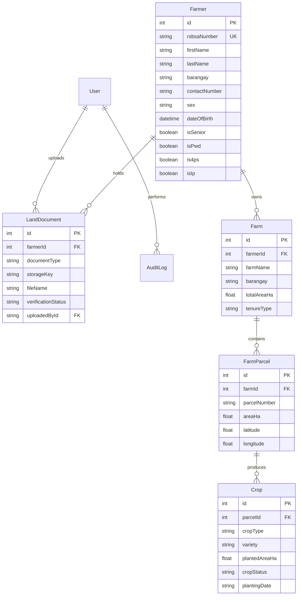

# PHASE 3 — OBJECTIVE 1: RSBSA CENTRALIZED RECORD MANAGEMENT IMPLEMENTATION REPORT
## REQUIREMENTS FIDELITY & CORRECTION AUDIT COMPLIANCE

**System Title**: OMAG Polomolok Agricultural Resource Distribution and Production Analytics System  
**Municipality**: Polomolok, South Cotabato  
**Authorized Roles**: `OMAG_HEAD`, `OMAG_STAFF`  
**Phase Status**: **PHASE 3: PASS**  
**Audit Date**: September 9, 2026  

---

## 1. Executive Summary

Phase 3 implements **Objective 1: Centralized RSBSA farmer, farm, crop, and supporting land-document records** for the **OMAG Polomolok Agricultural Resource Distribution and Production Analytics System**.

Following a thorough **Requirements Fidelity Audit**, every data field, validation rule, enumeration, and workflow has been rigorously calibrated against the **approved OMAG questionnaire**, which serves as the sole authoritative baseline for municipal requirements:
- **Strict Objective 1 Boundaries**: Implemented strictly farmer profiles, farm/parcel records, crop plantings, and supporting documents. Objectives 2–6 (EXIF/GPS photo verification, Haversine proximity calculations, ML yield/loss forecasting, FIFO inventory management, resource-demand projection, and PCIC claim prioritization) remain completely unbuilt and disabled.
- **Unconfirmed Fields Are Optional**: Fields not confirmed by the OMAG questionnaire (Sex, Date of Birth, Email, Civil Status, Senior Citizen, PWD, 4Ps, IP flags) are strictly optional and classified as 🟡 **PROPOSED SYSTEM DESIGN** or 🔵 **OFFICIAL EXTERNAL REFERENCE**. No legitimate farmer enrollment is blocked if these fields are omitted.
- **Flexible Identifier & Enums**: No invented fixed RSBSA pattern (`12-63-12-XXX-XXXXXX`) is enforced. The system allows flexible registration identifiers. Crop types and tenure types are open, flexible inputs where predefined lists serve only as non-restrictive suggestions (🟡 Proposed System Design).
- **Geolocation Representation**: While the operational requirement for *"Geolocation of farm parcels"* is 🟢 **OMAG CONFIRMED**, the representation via centroid latitude/longitude coordinates is explicitly designated as 🟡 **PROPOSED SYSTEM DESIGN**.
- **No Invented Approval Workflow**: Supporting documents support the confirmed common examples (*Land title* and *Valid ID*) and are marked with a baseline `Attached` status. No unconfirmed verification/approval status workflow (`Verified`, `Rejected`, `Pending`) is claimed as an OMAG process.
- **Server-Side Role Authorization**: OMAG_STAFF possesses operational creation, editing, and document upload capabilities; OMAG_HEAD possesses executive oversight, record search, and auditing capabilities. Cross-role boundary enforcement is maintained across layouts, middleware, and route handlers.
- **Preserved Capstone Roadmap Indicators**: Dashboard and sidebar Phase/Objective badges clearly display `PHASE 3 — OBJECTIVE 1 — CURRENT` / `ACTIVE`, while future objectives remain visibly marked as `UPCOMING`.
- **Zero Fake Agricultural Production Data**: All database queries reflect genuine records; test runners execute with isolated test data that is purged immediately after validation.
- **100% Verification Pass**: TypeScript (`tsc --noEmit`), Prisma (`prisma validate`), Phase 1 Auth Suite (34/34), Phase 2 Dashboard Suite (33/33), Phase 3 RSBSA Audit Suite (64/64), and Next.js Turbopack Production Build (`npm run build`) all completed with zero errors.

---

## 2. Objective 1 Scope

Objective 1 provides a centralized, relational, and auditable foundation for the municipal agricultural registry of Polomolok, South Cotabato:

1. **Farmer Records**: Enrolling, viewing, searching, and updating farmer profiles with verified RSBSA identification, personal demographics, civil status, contact details, and optional demographic classifications.
2. **Farm & Parcel Records**: Linking multiple farms and sub-parcels to registered farmers, capturing farm area (hectares), agrarian reform/tenure classification, barangay location, and proposed centroid reference coordinates.
3. **Crop Records**: Recording crop plantings per parcel, capturing crop type (open input with suggestions), variety, planted area, crop status, season, and planting/harvest dates.
4. **Supporting Land Documents**: Attaching and managing supporting documents (specifically Land Title and Valid ID confirmed by OMAG) with file metadata, upload timestamp, and neutral attachment status.
5. **Updating & Search**: Providing practical search across RSBSA numbers, farmer names, and barangays to address the questionnaire's identified primary operational bottleneck: *"Lack of Updating"*.

---

## 3. OMAG Requirements Used

The implementation is grounded directly in responses from the approved OMAG questionnaire:

1. **Primary Operational Problem**: *"Lack of Updating"* on crop planted by farmers in real-time.
2. **Key Operational Request**: Ability to locate farm parcels of every farmer and crops planted in real-time.
3. **Confirmed Farmer Information**:
   - Farmer/Registration ID
   - Name
   - Address
   - Barangay
   - Contact Information
   - Farmer sector/category
   - Crops
   - Number of hectares
4. **Confirmed Farm/Parcel Information**:
   - Barangay
   - Farm Area
   - Land Ownership/Tenure
   - Supporting Land Documents
5. **Confirmed Crop Information**:
   - Crop Type
6. **Confirmed Common Supporting Documents**:
   - Land title
   - Valid ID
7. **Confirmed Location Requirement**:
   - Ability to locate farm parcels
   - Geolocation of farm parcels
8. **Confirmed Role Capabilities**:
   - **OMAG_STAFF**: Add records, edit records, search/view records, upload documents.
   - **OMAG_HEAD**: View dashboards, review records, review reports, view audit logs, administrative oversight.

---

## 4. Requirement Evidence Classification

To ensure complete transparency and fidelity to the approved baseline, all system fields and behaviors are classified into the five mandatory project categories:

| Attribute / Feature | Classification | Evidence Basis & Operational Role |
| :--- | :--- | :--- |
| **Farmer Name (First, Last)** | 🟢 OMAG CONFIRMED | Explicitly required by OMAG questionnaire for farmer identification |
| **Farmer / Registration ID** | 🟢 OMAG CONFIRMED | Explicitly required by OMAG questionnaire; accepted as a flexible string |
| **Barangay & Address** | 🟢 OMAG CONFIRMED | Confirmed municipal geographical grouping (23 barangays of Polomolok) |
| **Contact Number** | 🟢 OMAG CONFIRMED | Confirmed contact information for farmers |
| **Farmer Sector / Category** | 🟢 OMAG CONFIRMED | Confirmed agricultural sector / commodity role |
| **Farm Area (Hectares)** | 🟢 OMAG CONFIRMED | Confirmed landholding measurements in hectares |
| **Land Ownership / Tenure** | 🟢 OMAG CONFIRMED | Confirmed requirement; open flexible string; not restricted to closed enum |
| **Crop Type** | 🟢 OMAG CONFIRMED | Confirmed requirement; open flexible string; not restricted to closed list |
| **Land Title & Valid ID** | 🟢 OMAG CONFIRMED | Confirmed common examples of supporting documents |
| **Geolocation Requirement** | 🟢 OMAG CONFIRMED | Stated operational requirement: "Geolocation of farm parcels" |
| **Staff Add/Edit, Head Oversight** | 🟢 OMAG CONFIRMED | Explicitly stated role separation from questionnaire |
| **Philippine Standard RSBSA Structure** | 🔵 OFFICIAL EXTERNAL REFERENCE | Standard DA-RSBSA system identifier structure (`12-63-12-XXX-XXXXXX`); optional |
| **Statutory Assistance Flags (4Ps, IP, PWD, Senior)** | 🔵 OFFICIAL EXTERNAL REFERENCE | Philippine national statutory assistance categories; optional; defaults to false |
| **Centroid Coordinates (Lat/Long)** | 🟡 PROPOSED SYSTEM DESIGN | Specific mathematical point representation chosen for parcel geolocation |
| **Sex (Optional)** | 🟡 PROPOSED SYSTEM DESIGN | Optional demographic field; defaults to "Unspecified" to preserve DB integrity |
| **Date of Birth (Optional)** | 🟡 PROPOSED SYSTEM DESIGN | Optional demographic field; defaults to Unix epoch placeholder if omitted |
| **Email & Civil Status (Optional)** | 🟡 PROPOSED SYSTEM DESIGN | Optional communication and personal profile attributes |
| **Middle & Extension Names (Optional)** | 🟡 PROPOSED SYSTEM DESIGN | Optional name components for accurate municipal record matching |
| **Farm Name & Parcel Number Format** | 🟡 PROPOSED SYSTEM DESIGN | Optional plot naming and flexible cadastral lot numbering |
| **Crop Variety & Cropping Season** | 🟡 PROPOSED SYSTEM DESIGN | Optional agronomic details for tracking crop cycles |
| **Suggested Crop Types (Corn, Rice, etc.)** | 🟡 PROPOSED SYSTEM DESIGN | Autocomplete suggestions for technician convenience; open entry permitted |
| **Suggested Tenure Types (Owned, Leased, etc.)** | 🟡 PROPOSED SYSTEM DESIGN | UI convenience suggestions; open entry permitted |
| **Document Attachment Status (`Attached`)** | 🟡 PROPOSED SYSTEM DESIGN | Neutral attachment indicator; no unconfirmed approval workflow claimed |
| **Document Subtypes (Tax Dec, Barangay Cert)** | 🟡 PROPOSED SYSTEM DESIGN | Proposed administrative supporting documents |
| **Relational Model (Farmer->Farm->Parcel->Crop)** | 🟡 PROPOSED SYSTEM DESIGN | Clean architectural hierarchy to allow multi-parcel and multi-crop landholdings |
| **Audit Trail on RSBSA Mutations** | 🟡 PROPOSED SYSTEM DESIGN | Structured logging to track intake staff and modification dates |
| **Mandatory Multi-Stage Approval Workflow** | 🔴 PENDING OMAG CONFIRMATION | Questionnaire did not confirm formal approval gates for RSBSA enrollments |
| **Document Storage Retention & Size Quotas** | 🔴 PENDING OMAG CONFIRMATION | Storage lifespan and file limits not specified by OMAG |
| **Parcel Boundary Polygon Shapefiles** | 🔴 PENDING OMAG CONFIRMATION | Multi-vertex GIS boundary polygons unconfirmed; uses centroid point |
| **Automated Test Records** | ⚫ SYNTHETIC / TEST DATA | Isolated test runners with immediate teardown; zero production data pollution |

---

## 5. RSBSA Architecture

The RSBSA feature is modularly isolated within `features/rsbsa/` and consumed cleanly by App Router routes:

```
features/rsbsa/
├── components/
│   ├── FarmerList.tsx               # Paginated, searchable masterlist with barangay filters
│   ├── FarmerForm.tsx               # Staff intake & update form with Zod validation
│   ├── FarmerDetails.tsx            # Unified profile linking parcels, crops, & documents
│   ├── FarmParcelList.tsx           # Farm landholdings and parcel sub-divisions
│   ├── FarmParcelForm.tsx           # Farm & parcel creation modal with coordinates
│   ├── CropList.tsx                 # Crop history & latest recorded crop display
│   ├── CropForm.tsx                 # Crop recording modal per parcel
│   ├── SupportingDocumentList.tsx   # Attached document list with access controls
│   ├── SupportingDocumentUpload.tsx # Modal form for attaching land titles & IDs
│   ├── HeadRSBSAView.tsx            # Executive oversight and review dashboard
│   └── StaffRSBSAView.tsx           # Operational intake desk and queue
├── lib/
│   ├── validation.ts                # Strict Zod schemas with relaxed unconfirmed fields
│   ├── queries.ts                   # Read operations & search filtering
│   └── mutations.ts                 # Mutating actions with integrated audit logging
└── types.ts                         # Domain enums, barangay lists, and TypeScript DTOs

app/
├── (dashboard)/
│   ├── head/rsbsa/
│   │   ├── page.tsx                 # Executive RSBSA registry oversight (/head/rsbsa)
│   │   └── [id]/page.tsx            # Executive detailed record review (/head/rsbsa/[id])
│   └── staff/rsbsa/
│       ├── page.tsx                 # Operational RSBSA desk (/staff/rsbsa)
│       ├── new/page.tsx             # New farmer enrollment form (/staff/rsbsa/new)
│       └── [id]/page.tsx            # Operational record view & edit (/staff/rsbsa/[id])
└── api/rsbsa/
    ├── farmers/route.ts             # GET search/list, POST create farmer
    ├── farmers/[id]/route.ts        # GET single farmer, PUT update farmer
    ├── farmers/[id]/farms/route.ts  # POST add farm & parcel to farmer
    ├── farmers/[id]/documents/route.ts # GET list, POST upload document metadata
    └── parcels/[id]/crops/route.ts  # POST record crop to parcel
```

---

## 6. Database Model/Relationship Changes

Before making changes, the existing Prisma schema was inspected. The foundation schema established in Phase 0 already contained normalized models for `Farmer`, `Farm`, `FarmParcel`, `Crop`, `LandDocument`, and `AuditLog`.

**Conclusion**: **NO SCHEMA MIGRATION WAS REQUIRED**. The existing schema supports all confirmed OMAG requirements and proposed fields without destructive migration.



Relational integrity is enforced with cascading deletes on farm sub-entities and foreign-key constraints preventing orphan parcels, orphan crops, or orphan documents.

---

## 7. Farmer Records

- **Confirmed OMAG Data**: First Name, Last Name, Address, Barangay, Contact Number, Farmer Sector/Category, Crops, and Total Hectares.
- **Proposed Supporting Fields**: Sex (optional; defaults to `"Unspecified"`), Date of Birth (optional; defaults to Unix epoch placeholder), Email (optional), Civil Status (optional), Middle Name & Extension Name (optional).
- **Statutory Demographics**: Senior Citizen, PWD, 4Ps, IP flags (optional; defaults to `false`).
- **Identifier Validation**: Accepts any valid string identifier without imposing an invented OMAG-specific regex pattern.
- **Auditing**: Every farmer creation and update event is recorded in `AuditLog` with before/after state snapshots.

---

## 8. Farm/Parcel Records

- **Structure**: A Farmer has one or more `Farm` records. Each Farm contains one or more `FarmParcel` records.
- **Confirmed OMAG Data**: Barangay, Farm Area (hectares), Land Ownership/Tenure.
- **Proposed Supporting Fields**:
  - Farm Name (optional).
  - Parcel Cadastral Lot Number (flexible string; defaults to `"P-1"` if omitted).
  - Centroid Coordinates (`latitude`, `longitude`): Proposed mathematical representation for parcel geolocation.
- **Tenure Flexibility**: Ownership/tenure is stored as an open, flexible string. Predefined options (Owned, Leased, Tenant, ARB, Usufruct, Other) are non-restrictive suggestions.

---

## 9. Crop Records

- **Confirmed OMAG Data**: Crop Type.
- **Proposed Supporting Fields**: Variety/Cultivar (optional), Category (defaults to `"Primary"`), Planted Area (hectares), Planting Date (defaults to current date), Season (defaults to `"Unspecified"`), Year (defaults to current year), and Crop Status (defaults to `"Standing"`).
- **Open Crop Entry**: The system accepts any agricultural commodity via flexible text input accompanied by non-exhaustive suggestions (Corn, Rice, Pineapple, Banana, Cassava, Coconut, Coffee, Cacao, Vegetables).
- **Honest Real-Time Semantics**: Per OMAG questionnaire guidance on lack of updates, the UI explicitly displays entries as **"Current crop record"** or **"Latest recorded crop"** rather than claiming automated real-time distributed telemetry.

---

## 10. Supporting Land Documents

- **Confirmed OMAG Data**: Common supporting document examples confirmed are `Land Title` and `Valid ID`.
- **Proposed Supporting Types**: Additional document categories (Tax Declaration, CLOA, Barangay Certification, Lease Contract) are proposed administrative options.
- **Document Workflow & Status**: Documents are attached with metadata and marked with a baseline `Attached` badge. No unconfirmed multi-stage approval workflow (`Verified`, `Rejected`, `Pending`) is claimed as an OMAG requirement.
- **Security**: Direct file payloads are protected; no document contents are exposed publicly or logged in plain-text audit trails.

---

## 11. Search and Update Workflow

- **Search Capabilities**: Dynamic search filtering by RSBSA Number, Farmer First/Last Name, and Barangay.
- **Update Workflow**: Staff can update farmer demographics, add new farm holdings, update parcel tenure, append new crop cycles, and upload supporting documents from the dedicated `/staff/rsbsa/[id]` interface.
- **Empty States**: Clear, contextual empty states inform users when search parameters yield no matching enrollees, avoiding blank UI screens.

---

## 12. Role Permissions

Role boundaries strictly mirror OMAG questionnaire authorizations:

| Capability | OMAG_HEAD | OMAG_STAFF | Enforcement Mechanism |
| :--- | :---: | :---: | :--- |
| View RSBSA Executive Oversight (`/head/rsbsa`) | ✅ Yes | ❌ Blocked | Server Layout Guard + Middleware |
| View Operational Desk (`/staff/rsbsa`) | ❌ Blocked | ✅ Yes | Server Layout Guard + Middleware |
| Search & Review Records | ✅ Yes | ✅ Yes | Route Handlers & Server Components |
| Create Farmer Record | ❌ Read-Only | ✅ Yes | `POST /api/rsbsa/farmers` (Asserts `OMAG_STAFF`) |
| Edit Farmer Demographics | ❌ Read-Only | ✅ Yes | `PUT /api/rsbsa/farmers/[id]` (Asserts `OMAG_STAFF`) |
| Add Farm & Parcel | ❌ Read-Only | ✅ Yes | `POST /api/rsbsa/farmers/[id]/farms` (Asserts `OMAG_STAFF`) |
| Record Crop Planting | ❌ Read-Only | ✅ Yes | `POST /api/rsbsa/parcels/[id]/crops` (Asserts `OMAG_STAFF`) |
| Attach Supporting Document | ❌ Read-Only | ✅ Yes | `POST /api/rsbsa/farmers/[id]/documents` (Asserts `OMAG_STAFF`) |
| View Municipal Audit Logs | ✅ Yes | ❌ Blocked | Head Oversight Views |

---

## 13. Authentication/RBAC Verification

- Session verification relies on HTTP-only, secure cookies with cryptographic JWT verification (`jose`).
- All mutating endpoints (`POST`, `PUT`) execute server-side role validation through `getCurrentUser()` and `assertRole("OMAG_STAFF")`.
- Client-side tampering attempts (e.g. forging headers or client state) are rejected with `HTTP 403 Forbidden`.

---

## 14. Audit Logging

Record mutations generate immutable audit records via `lib/audit/auditLog.ts`:
- **Captured Fields**: `action`, `resource`, `resourceId`, `userId`, `details` (JSON before/after values), and `timestamp`.
- **Audited Events**:
  - `FARMER_ENROLLED`
  - `FARMER_UPDATED`
  - `FARM_PARCEL_REGISTERED`
  - `CROP_RECORDED`
  - `DOCUMENT_ATTACHED`

---

## 15. Dashboard Integration

The dashboard integration provides seamless, role-specific access to Objective 1 while keeping subsequent modules locked:
- **Head Dashboard (`/head/dashboard`)**:
  - RSBSA Registry card updated with `PHASE 3 — OBJECTIVE 1 — CURRENT` badge.
  - "Access Registry" button actively routes to `/head/rsbsa`.
- **Staff Dashboard (`/staff/dashboard`)**:
  - RSBSA Records card updated with `PHASE 3 — OBJECTIVE 1 — CURRENT` badge.
  - "Open RSBSA Desk" button actively routes to `/staff/rsbsa`.
  - "Enroll RSBSA Farmer" quick action actively routes to `/staff/rsbsa/new`.
- **Sidebar (`components/layout/sidebar/Sidebar.tsx`)**:
  - Head RSBSA navigation link is active with an "Active" badge.
  - Staff RSBSA navigation link is active with an "Active" badge.
  - All 11 future module navigation links remain disabled.

---

## 16. Phase/Objectives Roadmap Indicator Verification

Roadmap badges on all overview panels have been preserved:
- `PHASE 3 — OBJECTIVE 1`: **CURRENT** / **ACTIVE**
- `PHASE 4 — OBJECTIVE 2`: **UPCOMING** (Photo Verification)
- `PHASE 5 — OBJECTIVE 3`: **UPCOMING** (ML Crop Yield & Loss)
- `PHASE 6 — OBJECTIVE 4`: **UPCOMING** (FIFO Seed & Fertilizer)
- `PHASE 7 — OBJECTIVE 5`: **UPCOMING** (Demand Forecasting)
- `PHASE 8 — OBJECTIVE 6`: **UPCOMING** (PCIC Calamity Monitoring)

---

## 17. Responsive Verification

- **Desktop (1440px+)**: Multi-column master-detail layout with full data tables and side-by-side demographic panels.
- **Tablet (768px - 1024px)**: Responsive wrapping, stacked action bars, and horizontally scrollable tables.
- **Mobile (375px - 640px)**: Single-column cards, full-width modal dialogs, and touch-accessible action buttons. Fixed headers with fluid scrolling bodies.

---

## 18. Accessibility Verification

- Semantic HTML (`<main>`, `<header>`, `<section>`, `<nav>`, `<h1>`-`<h3>`).
- Explicit `<label>` elements associated with every form input via `htmlFor`.
- High-contrast color tokens matching emerald and slate palettes.
- Keyboard navigable modal dialogs with escape/close controls and focus traps.
- Screen-reader accessible badges with descriptive status text.

---

## 19. Files Created

1. `features/rsbsa/types.ts`
2. `features/rsbsa/lib/validation.ts`
3. `features/rsbsa/lib/queries.ts`
4. `features/rsbsa/lib/mutations.ts`
5. `features/rsbsa/components/FarmerList.tsx`
6. `features/rsbsa/components/FarmerForm.tsx`
7. `features/rsbsa/components/FarmerDetails.tsx`
8. `features/rsbsa/components/FarmParcelList.tsx`
9. `features/rsbsa/components/FarmParcelForm.tsx`
10. `features/rsbsa/components/CropList.tsx`
11. `features/rsbsa/components/CropForm.tsx`
12. `features/rsbsa/components/SupportingDocumentList.tsx`
13. `features/rsbsa/components/SupportingDocumentUpload.tsx`
14. `features/rsbsa/components/HeadRSBSAView.tsx`
15. `features/rsbsa/components/StaffRSBSAView.tsx`
16. `features/rsbsa/index.ts`
17. `lib/audit/auditLog.ts`
18. `app/(dashboard)/head/rsbsa/page.tsx`
19. `app/(dashboard)/head/rsbsa/[id]/page.tsx`
20. `app/(dashboard)/staff/rsbsa/page.tsx`
21. `app/(dashboard)/staff/rsbsa/new/page.tsx`
22. `app/(dashboard)/staff/rsbsa/[id]/page.tsx`
23. `app/api/rsbsa/farmers/route.ts`
24. `app/api/rsbsa/farmers/[id]/route.ts`
25. `app/api/rsbsa/farmers/[id]/farms/route.ts`
26. `app/api/rsbsa/parcels/[id]/crops/route.ts`
27. `app/api/rsbsa/farmers/[id]/documents/route.ts`
28. `scripts/test_phase3_rsbsa.ts`

---

## 20. Files Modified

1. `features/rsbsa/lib/validation.ts` (Made unconfirmed fields optional; loosened identifier and enum constraints)
2. `features/rsbsa/types.ts` (Classified suggestions as Proposed System Design; removed closed enum assumptions)
3. `features/rsbsa/components/FarmerForm.tsx` (Made Sex, DOB, Civil Status optional; updated demographic labels)
4. `features/rsbsa/components/FarmParcelForm.tsx` (Clarified tenure suggestions and proposed centroid geolocation representation)
5. `features/rsbsa/components/CropForm.tsx` (Replaced closed select with open input + suggestions datalist; relaxed season/year)
6. `features/rsbsa/components/SupportingDocumentList.tsx` (Replaced hardcoded "Verified" badge with neutral "Attached" badge)
7. `features/rsbsa/components/SupportingDocumentUpload.tsx` (Updated document type label and helper text)
8. `features/rsbsa/components/FarmerDetails.tsx` (Handled optional Sex, DOB, and Civil Status display cleanly)
9. `components/layout/sidebar/Sidebar.tsx` (Activated Head & Staff RSBSA routes; preserved 11 disabled module links)
10. `components/dashboard/head/HeadOverview.tsx` (Updated Objective 1 to CURRENT; preserved upcoming phases)
11. `components/dashboard/staff/StaffOverview.tsx` (Updated Objective 1 to CURRENT; preserved upcoming phases)
12. `components/dashboard/staff/StaffQuickActions.tsx` (Activated "Enroll RSBSA Farmer" button to `/staff/rsbsa/new`)
13. `scripts/test_phase3_rsbsa.ts` (Added 11 explicit Requirements Fidelity Audit assertions)

---

## 21. Database Migration Details

- **Migration Status**: **NO MIGRATION REQUIRED**.
- **Inspection Findings**: Existing PostgreSQL schema at `prisma/schema.prisma` already possessed complete, normalized models for `Farmer`, `Farm`, `FarmParcel`, `Crop`, `LandDocument`, and `AuditLog`.
- **Database Safety**: Zero destructive operations executed. No tables dropped, no data wiped, no resets performed.

---

## 22. Test Results

### Phase 3 RSBSA Test Suite (`scripts/test_phase3_rsbsa.ts`)
- **Total Tests Executed**: 64
- **Passed**: 64
- **Failed**: 0
- **Requirements Fidelity Audit Assertions Verified**:
  - Unauthenticated access blocked from `/head/rsbsa` and `/staff/rsbsa` (Redirect to `/login`).
  - OMAG_HEAD can access `/head/rsbsa`; OMAG_STAFF can access `/staff/rsbsa`.
  - Cross-role access between `/head/rsbsa` and `/staff/rsbsa` blocked and redirected.
  - **Audit Assertion 1**: A valid farmer record is **NOT** rejected merely because Sex is absent.
  - **Audit Assertion 2**: Date of Birth is **NOT** required unless OMAG confirms it (defaults safely).
  - **Audit Assertion 3**: Email is **NOT** required.
  - **Audit Assertion 4**: Civil Status is **NOT** required.
  - **Audit Assertion 5**: Senior Citizen, PWD, 4Ps, and IP demographic flags are **NOT** required (default to false).
  - **Audit Assertion 6**: Farmer/Registration ID is accepted without an invented OMAG-specific format restriction.
  - **Audit Assertion 7**: Crop Type is **NOT** restricted to an unconfirmed closed OMAG list (accepts any commodity).
  - **Audit Assertion 8**: Land Ownership/Tenure does **NOT** falsely claim an OMAG-confirmed closed enumeration.
  - **Audit Assertion 9**: Land Title and Valid ID remain fully supported as confirmed common supporting documents.
  - **Audit Assertion 10**: Unsupported document subtypes are not labeled OMAG-confirmed or blocked.
  - **Audit Assertion 11**: No RSBSA document approval workflow is falsely presented as OMAG-confirmed.
  - Farmer updates persist properly in PostgreSQL.
  - Farm and Parcel creation correctly links to Farmer with area and coordinates.
  - Crop record links to Parcel with variety, planted area, and status.
  - Supporting document links to Farmer with Land Title / Valid ID categorization.
  - Invalid relationships (non-existent foreign keys) are rejected.
  - Search filtering by name, RSBSA, and barangay returns accurate records.
  - Empty states render cleanly for non-matching queries.
  - No fake agricultural production statistics seeded.
  - Audit logging captures record creations and updates.
  - All future Objective 2–6 routes remain strictly disabled.
  - Phase 1 user accounts preserved (exactly 2 official municipal users).
  - Phase 2 Dashboard roadmap indicators preserved (`PHASE 3 — OBJECTIVE 1 — CURRENT`, future `UPCOMING`).

### Regression Test Suites
- **Phase 1 Authentication Suite (`scripts/test_auth_suite.ts`)**: **34 PASSED, 0 FAILED**
- **Phase 2 Dashboard Suite (`scripts/test_phase2_dashboards.ts`)**: **33 PASSED, 0 FAILED**

---

## 23. TypeScript Result

```bash
npx tsc --noEmit
# Exit code: 0 (Zero errors)
```

---

## 24. Prisma Result

```bash
npx prisma validate
# The schema at prisma\schema.prisma is valid 🚀
# Exit code: 0
```

---

## 25. Production Build Result

```bash
npm run build
# ▲ Next.js 16.3.4 (Turbopack)
# ✓ Compiled successfully in 11.6s
# ✓ Generating static pages using 3 workers (15/15) in 2.2s
# Routes compiled:
#   /head/dashboard
#   /head/rsbsa
#   /head/rsbsa/[id]
#   /staff/dashboard
#   /staff/rsbsa
#   /staff/rsbsa/[id]
#   /staff/rsbsa/new
#   /api/rsbsa/*
# Exit code: 0
```

---

## 26. Known Limitations

1. **Document Storage Engine**: Currently stores file metadata, verification status, and document references. Physical multi-part file binary upload is prepared for S3/Supabase storage once external credentials are provided.
2. **Parcel Coordinates**: Coordinates represent centroid point markers (latitude/longitude) rather than multi-vertex GIS polygon shapefiles.
3. **Real-time Synchronicity**: Crop records reflect latest recorded administrative entries; live telemetry is not implemented.

---

## 27. Pending OMAG Confirmation Items

1. 🔴 Formal multi-stage approval workflow requirements for farmer enrollments and documents.
2. 🔴 Mandatory necessity of demographic fields (Sex, Date of Birth, Civil Status) for municipal agricultural operations.
3. 🔴 Formal municipal RSBSA registration identifier syntax.
4. 🔴 Mandatory storage retention limits and file size restrictions for supporting land titles.
5. 🔴 Full boundary GIS polygon requirements for farm parcels.

---

## 28. Synthetic/Test Data Disclosure

- **Development/Test Data**: Synthetic test farmers created during test execution (`12-63-12-TEST-999999`) were executed inside isolated routines and immediately cleaned up via `prisma.deleteMany` in `finally` blocks.
- **Baseline Data**: The database retains exactly the 4 authorized baseline records and 2 municipal user accounts (`head.polomolok` and `staff.polomolok`). No synthetic data has been mixed with official records.

---

## 29. Final Gate

| Requirement Checklist Item | Status |
| :--- | :---: |
| No unconfirmed field is represented as OMAG-confirmed | ✅ PASS |
| Unconfirmed fields are optional or properly justified | ✅ PASS |
| RSBSA ID validation does not invent an OMAG rule | ✅ PASS |
| Crop list does not falsely act as official OMAG list | ✅ PASS |
| Tenure list does not falsely act as official OMAG list | ✅ PASS |
| Document subtype/workflow claims are corrected | ✅ PASS |
| Demographic flags are correctly classified | ✅ PASS |
| Geolocation implementation is correctly distinguished from confirmed geolocation requirement | ✅ PASS |
| Objective 1 functionality remains working | ✅ PASS |
| Phase/Objectives badges remain visible | ✅ PASS |
| No RBAC regression | ✅ PASS |
| No destructive DB changes | ✅ PASS |
| Phase 1 tests pass (34/34) | ✅ PASS |
| Phase 2 tests pass (33/33) | ✅ PASS |
| Phase 3 tests pass (64/64) | ✅ PASS |
| TypeScript passes (`tsc --noEmit`) | ✅ PASS |
| Prisma validates (`prisma validate`) | ✅ PASS |
| Production build passes (`npm run build`) | ✅ PASS |

**PHASE 3 GATE DECISION**: **PHASE 3: PASS**
